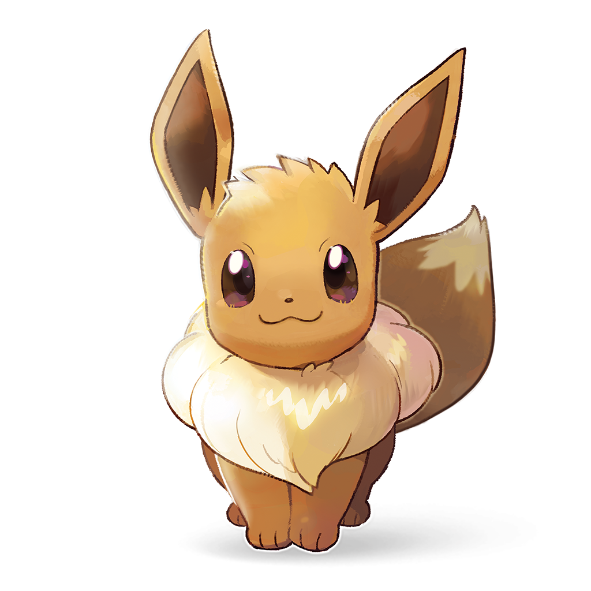

# Eevee

This is the simple Discord bot written in Python 3.5 with discord.py library.

<h2>Requirements:</h2>
Python 3.5 - https://www.python.org/downloads/.  

<h2>Configuration:</h2>
Open and Edit: 'config.ini' in config folder.
If config file does not exist run config_file_create.py in "config" folder. 

